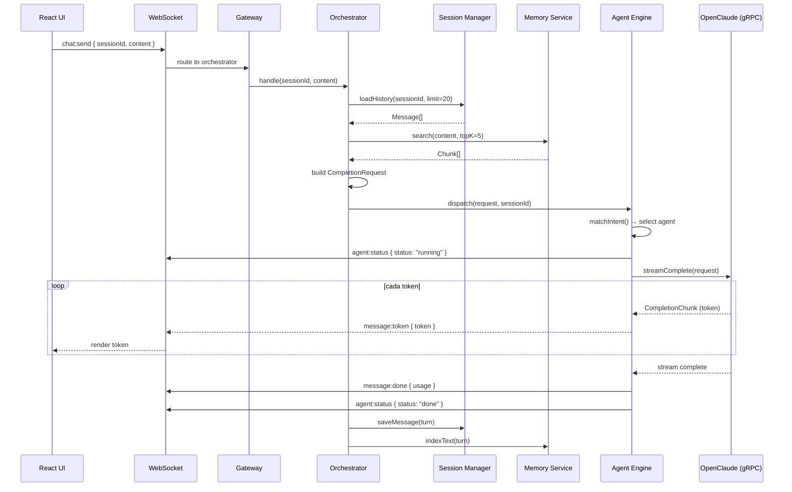
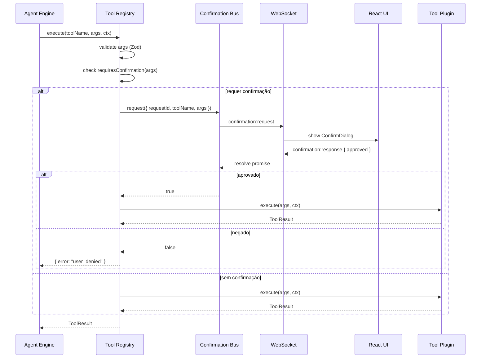
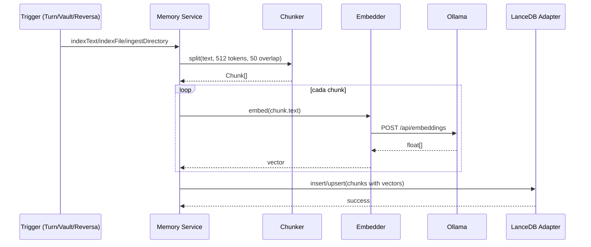
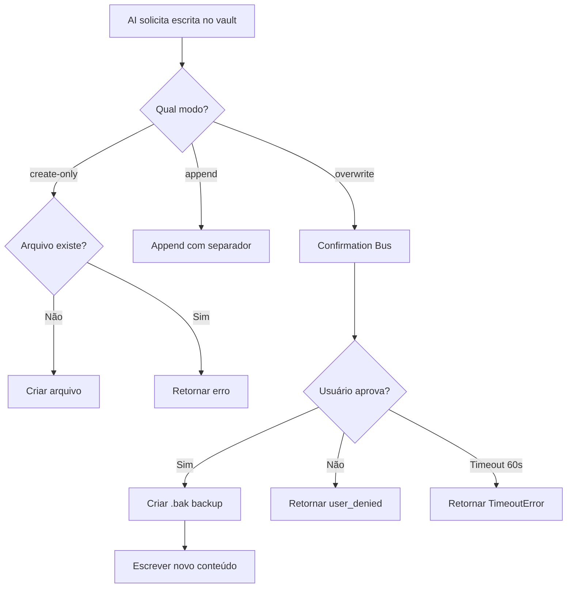

# Design Document — Clover Local AI Assistant

## Overview

Clover é um assistente de IA desktop local-first, cross-platform (Windows/macOS/Linux), construído com Tauri + React (UI), Node.js (backend/orchestrator), OpenClaude gRPC (AI core), Ollama (inferência + embeddings), LanceDB embedded (memória vetorial), Obsidian vault (base de conhecimento), SQLite (sessões) e DuckDuckGo (busca online substituível via adapter pattern).

O sistema opera sem Docker e sem dependência de cloud. Toda inferência de IA roda localmente via Ollama. A comunicação entre UI e backend ocorre exclusivamente via HTTP REST + WebSocket em localhost. O backend se comunica com OpenClaude via gRPC (porta 50051) e com Ollama via HTTP (porta 11434).

### Decisões Técnicas Chave

| Decisão | Escolha | Justificativa |
|---------|---------|---------------|
| Desktop shell | Tauri | ~10x menor que Electron; sandbox de filesystem nativo via Rust; sem Node.js bundled |
| Vector DB | LanceDB (embedded) | Embedded no processo Node.js — sem servidor, sem Docker; API nativa Node.js |
| Persistência de sessão | SQLite via `better-sqlite3` | Embedded, zero-config, transacional, padrão para desktop single-user |
| HTTP framework | Fastify | Serialização rápida; validação de schema nativa; plugin `@fastify/websocket` maduro |
| Monorepo | pnpm workspaces | Compartilha `types/` e `protos/` entre UI e backend sem publicar pacotes |
| gRPC client | `@grpc/grpc-js` | Pure Node.js, sem binários nativos; biblioteca gRPC oficial |
| Text chunking | `tiktoken` | Chunking preciso por token, compatível com tokenizer do modelo |
| State management (UI) | Zustand | Boilerplate mínimo; sem complexidade Redux para app single-user |
| Busca online | DuckDuckGo adapter | Gratuito, sem API key para v1; adapter pattern permite troca sem alterar callers |
| Busca offline | LanceDB offline adapter | Evita Docker; mesma capacidade de busca semântica; reutiliza instância LanceDB já embedded |

---

## Architecture

```
┌─────────────────────────────────────────────────────────┐
│                     TAURI SHELL                          │
│  ┌───────────────────────────────────────────────────┐  │
│  │                   React UI                         │  │
│  │   Chat | FileExplorer | Terminal | AgentPanel      │  │
│  │              ConfirmDialog | ModelSelector          │  │
│  └────────────────────┬──────────────────────────────┘  │
└───────────────────────┼─────────────────────────────────┘
                        │ HTTP REST + WebSocket
                        │ (localhost:3001 only)
┌───────────────────────▼─────────────────────────────────┐
│                  Node.js BACKEND                         │
│                                                          │
│  Gateway (Fastify HTTP + WebSocket)                      │
│       │                                                  │
│  Orchestrator ──────► Agent Engine                       │
│       │                    │                             │
│  Session Manager    Tool Registry ──► plugins/*.tool.ts  │
│  (SQLite)                  │                             │
│                     ┌──────┼──────┐                      │
│                 Memory   Search  Exec Guard              │
│                 Service  Service  (subprocess)           │
│                 (LanceDB  (DDG /                         │
│                 +Obsidian) Offline)                      │
│                                                          │
│  Confirmation Bus (WS bridge para ops destrutivas)       │
│  Planner Service (gera documentos de planejamento)       │
└──────────────────────────┬──────────────────────────────┘
                           │ gRPC (port 50051)
                  ┌────────▼──────────┐
                  │  OpenClaude gRPC  │
                  │  Service          │
                  └────────┬──────────┘
                           │ HTTP (port 11434)
                  ┌────────▼──────────┐
                  │     Ollama        │
                  │  (inference +     │
                  │   embeddings)     │
                  └───────────────────┘
```

### Fluxo de Dependências (one-way)

```
shared/          ← sem imports de apps/
apps/ui/         ← importa apenas de shared/types/; nunca de apps/backend/
apps/backend/    ← importa de shared/ apenas (não de apps/ui/)

Dentro do backend (direção única):
  gateway → orchestrator → agents → tools / memory / search
  tools → exec-guard / memory.service / search.service
  memory.service → lancedb.adapter, obsidian.adapter, embedder, chunker
  NENHUM módulo importa seu caller
```

---

## Components and Interfaces

### Tabela de Componentes

| Componente | Localização | Responsabilidade | Depende De |
|-----------|----------|----------------|-----------|
| React UI | `apps/ui/src/` | Renderizar todos os painéis; comunicar via HTTP+WS apenas | `http.client`, `ws.client`, Zustand stores |
| Tauri Shell | `apps/ui/src-tauri/` | Janela nativa; enforcement de allowlist de filesystem | OS |
| Gateway | `apps/backend/src/gateway/` | Servidor Fastify HTTP + WS; rotear requests para orchestrator; emitir eventos WS | Fastify, `orchestrator` |
| Orchestrator | `apps/backend/src/orchestrator/` | Construir contexto de sessão; chamar memory search; despachar para agent engine | `session.manager`, `memory.service`, `agent-engine` |
| Session Manager | `apps/backend/src/orchestrator/session.manager.ts` | Carregar/salvar histórico de conversação do SQLite; construir context window | `sqlite.store` |
| Agent Engine | `apps/backend/src/agents/agent-engine.ts` | Selecionar agente por intenção; gerenciar lifecycle; interceptar tool_calls; emitir status events | todos os agents, `tool-registry`, `openclaude.client` |
| Agents (×6) | `apps/backend/src/agents/*.agent.ts` | System prompt + tool allowlist + intent matcher por tipo de agente | `tool-registry`, `openclaude.client` |
| Tool Registry | `apps/backend/src/tools/tool-registry.ts` | Auto-descobrir plugins; validar args com Zod; checar confirmação; rotear execução | `confirmation.bus`, plugin files |
| Tool Plugins (×9) | `apps/backend/src/tools/plugins/` | Um arquivo por ferramenta; implementa interface `ToolPlugin` | `exec-guard`, `memory.service`, `search.service` |
| Memory Service | `apps/backend/src/memory/memory.service.ts` | Interface pública para todas as ops de memória; coordena sub-adapters | `lancedb.adapter`, `obsidian.adapter`, `embedder`, `chunker`, `vault.watcher` |
| LanceDB Adapter | `apps/backend/src/memory/lancedb.adapter.ts` | Insert/upsert/search vetores no LanceDB | LanceDB SDK |
| Obsidian Adapter | `apps/backend/src/memory/obsidian.adapter.ts` | Ler/escrever arquivos markdown com regras de segurança; backup antes de overwrite | Node.js `fs` |
| Embedder | `apps/backend/src/memory/embedder.ts` | Converter texto em float[] via Ollama `/api/embeddings` | `ollama.client` |
| Chunker | `apps/backend/src/memory/chunker.ts` | Dividir texto em chunks (512 tokens, 50 overlap) | `tiktoken` |
| Vault Watcher | `apps/backend/src/memory/vault.watcher.ts` | `fs.watch` no vault path; trigger re-index incremental em mudanças | `memory.service` |
| Search Service | `apps/backend/src/search/search.service.ts` | Interface unificada de busca; auto-selecionar adapter por conectividade | `duckduckgo.adapter`, `offline.adapter`, `connectivity.check` |
| DuckDuckGo Adapter | `apps/backend/src/search/duckduckgo.adapter.ts` | Implementa `SearchAdapter`; consulta DuckDuckGo | node-fetch |
| Offline Adapter | `apps/backend/src/search/offline.adapter.ts` | Implementa `SearchAdapter`; busca cosine no LanceDB knowledge index | `lancedb.adapter` |
| Connectivity Check | `apps/backend/src/search/connectivity.check.ts` | HEAD request para endpoint confiável; retorna boolean | node-fetch |
| Exec Guard | `apps/backend/src/exec-guard/exec-guard.ts` | `child_process.spawn` com cwd=workspace, timeout=30s, deny-list enforcement | Node.js `child_process` |
| Deny List | `apps/backend/src/exec-guard/deny-list.ts` | Padrões de comandos bloqueados: `rm -rf /`, `format`, `mkfs`, `dd if=` | — |
| Confirmation Bus | `apps/backend/src/confirmation/confirmation.bus.ts` | Emitir `confirmation:request` via WS; aguardar `confirmation:response` Promise (60s timeout) | `ws.server` |
| Planner Service | `apps/backend/src/planner/planner.service.ts` | Orquestrar pipeline de planejamento de 4 fases; escrever docs de planejamento | `openclaude.client`, `memory.service`, `obsidian.adapter` |
| Planning Templates | `apps/backend/src/planner/templates/` | requirements.prompt.ts, design.prompt.ts, tasks.prompt.ts | — |
| OpenClaude Client | `apps/backend/src/openclaude/openclaude.client.ts` | Cliente gRPC para OpenClaude :50051; streaming; reconexão | `@grpc/grpc-js` |
| Ollama Client | `apps/backend/src/ollama/ollama.client.ts` | Cliente HTTP para Ollama :11434 (chat, embeddings, model list); retry | node-fetch |
| SQLite Store | `apps/backend/src/storage/sqlite.store.ts` | Session CRUD; message history; tool execution audit log | `better-sqlite3` |
| Config | `apps/backend/src/config/config.ts` | Carregar `default.config.json` + env var overrides; typed config object | — |
| Shared Types | `shared/types/` | Interfaces TypeScript para todos os contratos inter-módulo | — |
| Protobuf Definitions | `shared/protos/openclaude.proto` | Definições de mensagem e serviço gRPC | — |

### Interfaces Principais

#### ToolPlugin Interface

```typescript
interface ToolPlugin {
  name: string;
  description: string;
  inputSchema: z.ZodSchema;
  requiresConfirmation: (args: unknown) => boolean;
  execute: (args: unknown, ctx: ToolContext) => Promise<ToolResult>;
}

interface ToolContext {
  workspacePath: string;
  sessionId: string;
  execGuard: ExecGuard;
  emitEvent: (type: string, data: unknown) => void;
}

interface ToolResult {
  success: boolean;
  output: string;
  error?: string;
}
```

#### SearchAdapter Interface

```typescript
interface SearchAdapter {
  name: string;
  isAvailable(): Promise<boolean>;
  search(query: string, options: SearchOptions): Promise<SearchResult[]>;
}

interface SearchOptions {
  maxResults?: number;
  source?: string;
}

interface SearchResult {
  title: string;
  url?: string;
  snippet: string;
  source: string;
}
```

#### Agent Interface

```typescript
interface Agent {
  name: string;
  systemPrompt: string;
  allowedTools: string[];
  matchesIntent(message: string, context?: AgentContext): boolean;
  maxTurns: number;
}
```

#### HTTP REST Contracts (localhost:3001)

```
POST   /api/sessions                     body: { workspacePath }      → { sessionId, createdAt }
GET    /api/sessions/:id/history                                       → Message[]
DELETE /api/sessions/:id                                               → 204

POST   /api/chat/message                 body: { sessionId, content } → 202 { queued:true }

GET    /api/files?path=                                                → { content, mtime, size }
POST   /api/files                        body: { path, content }      → 201 | 409
PATCH  /api/files                        body: { path, operations }   → 200 { linesChanged }
DELETE /api/files                        body: { path }               → 200 | 403

GET    /api/filesystem/tree?root=&depth=                              → FileNode[]

POST   /api/terminal/sessions            body: { sessionId }          → { terminalId }
DELETE /api/terminal/sessions/:id                                      → 204

GET    /api/memory/search?q=&topK=&source=                            → Chunk[]
POST   /api/memory/ingest                body: { path }               → 202 { taskId }

POST   /api/planner/generate             body: { goal, workspacePath }→ 202 { taskId }

GET    /api/models                                                     → OllamaModel[]
PATCH  /api/config/model                 body: { model }              → 200

GET    /api/health                                                     → { openclaude, ollama, lancedb, sqlite }
```

#### WebSocket Events

```typescript
// Backend → UI
{ type: "message:token",          data: { sessionId, token: string } }
{ type: "message:done",           data: { sessionId, usage: { inputTokens, outputTokens } } }
{ type: "message:error",          data: { sessionId, error: string } }
{ type: "agent:status",           data: { agent, status: "idle"|"running"|"done"|"error", detail? } }
{ type: "tool:executing",         data: { toolName, args } }
{ type: "tool:result",            data: { toolName, success, output } }
{ type: "terminal:output",        data: { terminalId, chunk, stream: "stdout"|"stderr" } }
{ type: "terminal:exit",          data: { terminalId, exitCode } }
{ type: "confirmation:request",   data: { requestId, toolName, operation, details, args } }
{ type: "memory:indexed",         data: { source, chunks, path? } }
{ type: "planner:progress",       data: { phase: "requirements"|"design"|"tasks", status } }
{ type: "planner:done",           data: { files: string[] } }

// UI → Backend
{ type: "chat:send",              data: { sessionId, content } }
{ type: "terminal:input",         data: { terminalId, input } }
{ type: "confirmation:response",  data: { requestId, approved: boolean } }
{ type: "agent:cancel",           data: { sessionId } }
```

#### gRPC Service (openclaude.proto)

```protobuf
service CompletionService {
  rpc StreamComplete (CompletionRequest) returns (stream CompletionChunk);
  rpc Complete       (CompletionRequest) returns (CompletionResponse);
}
```

---

## Data Models

### SQLite Schema

```sql
-- Sessões de conversação
CREATE TABLE sessions (
  id          TEXT PRIMARY KEY,
  workspace   TEXT NOT NULL,
  model       TEXT,
  created_at  TEXT NOT NULL DEFAULT (datetime('now')),
  updated_at  TEXT NOT NULL DEFAULT (datetime('now'))
);

-- Histórico de mensagens
CREATE TABLE messages (
  id          INTEGER PRIMARY KEY AUTOINCREMENT,
  session_id  TEXT NOT NULL REFERENCES sessions(id) ON DELETE CASCADE,
  role        TEXT NOT NULL CHECK(role IN ('system','user','assistant','tool')),
  content     TEXT NOT NULL,
  tool_name   TEXT,
  tool_call_id TEXT,
  created_at  TEXT NOT NULL DEFAULT (datetime('now'))
);

CREATE INDEX idx_messages_session ON messages(session_id, created_at);

-- Log de execução de ferramentas
CREATE TABLE tool_executions (
  id          INTEGER PRIMARY KEY AUTOINCREMENT,
  session_id  TEXT NOT NULL REFERENCES sessions(id) ON DELETE CASCADE,
  tool_name   TEXT NOT NULL,
  args        TEXT NOT NULL,  -- JSON serializado
  result      TEXT,           -- JSON serializado
  success     INTEGER NOT NULL DEFAULT 0,
  duration_ms INTEGER,
  created_at  TEXT NOT NULL DEFAULT (datetime('now'))
);
```

### LanceDB Vector Schema

```typescript
interface VectorChunk {
  id: string;           // UUID único do chunk
  source: string;       // "conversation" | "vault" | "reversa"
  filePath?: string;    // caminho do arquivo de origem (vault/reversa)
  sessionId?: string;   // sessão de origem (conversation)
  text: string;         // texto do chunk
  vector: Float32Array; // embedding vector
  timestamp: string;    // ISO 8601
  metadata?: Record<string, string>; // metadados adicionais
}
```

### Modelos de Configuração

```typescript
// default.config.json
interface Config {
  gateway: {
    port: number;        // default: 3001
    host: string;        // default: "localhost"
    corsOrigin: string;  // default: "http://localhost:1420"
  };
  openclaude: {
    host: string;        // default: "localhost"
    port: number;        // default: 50051
  };
  ollama: {
    host: string;        // default: "http://localhost:11434"
    retryAttempts: number; // default: 3
    retryBackoffMs: number; // default: 1000
  };
  memory: {
    dbPath: string;      // default: "./data/lancedb"
    topK: number;        // default: 5
    chunkSize: number;   // default: 512
    chunkOverlap: number; // default: 50
  };
  vault: {
    path: string;        // caminho do vault Obsidian
    watchDebounceMs: number; // default: 500
  };
  execGuard: {
    timeoutMs: number;   // default: 30000
  };
  confirmation: {
    timeoutMs: number;   // default: 60000
  };
  session: {
    historyLimit: number; // default: 20
  };
}

// models.config.json
interface ModelConfig {
  models: Array<{
    name: string;
    provider: "ollama";
    capabilities: ("chat" | "embed")[];
    contextWindow?: number;
    default?: boolean;
  }>;
}
```

### Data Flow: Mensagem do Usuário → Resposta Streamed



### Data Flow: Tool Call com Confirmação



### Data Flow: Memory Write (Indexação)



### Data Flow: Vault Write Rules



