# CloverOS — Request for Architecture Proposal (RAP)

> **Status:** Proposta (Draft 1)
> **Data:** 2026-06-28
> **Autor da revisão:** Arquiteto independente (revisão crítica contratada)
> **Escopo:** Greenfield ideal (o código atual é tratado como evidência, não como
> restrição). **Runtime:** Node.js + TypeScript (sem Deno, sem core nativo).
> **Princípio:** nenhuma decisão é mantida apenas por ter sido sugerida. Cada escolha
> compara alternativas, expõe trade-offs e descarta o que for inferior.

---

## 0. Sumário executivo (TL;DR das decisões)

O Clover não deve ser arquitetado como um "assistente que chama tools em JSON". Ele
deve ser arquitetado como um **microkernel de orquestração de agentes** onde:

1. **A confiabilidade vem da estrutura, não do modelo.** Modelos de ~8B falham ao
   produzir JSON arbitrário. A correção real é **constrained decoding (gramática
   GBNF/structured outputs)** emitindo uma **Intermediate Representation (IR) tipada e
   declarativa** — não pedir ao modelo que "se comporte". Isso é o item de maior
   impacto de todo o documento.
2. **Macro-arquitetura:** **Microkernel + Plugin Architecture**. Kernel mínimo e
   confiável; agents, tools, models, linguagens e backends são plugins sobre uma ABI
   estável.
3. **Execução/concorrência:** **Actor Model** (workers pequenos, isolados, mailbox)
   sobre **Event-Driven backbone**. Casa com "centenas de agentes" e mitiga a
   degradação de contexto.
4. **Planejamento:** **plan-and-execute hierárquico**, com **DAG durável** como
   substrato de execução e **re-planejamento** iterativo.
5. **Estado (um só modelo):** **Event Sourcing + Snapshots + projeções SQLite
   nativas**. Entrega replay, time-travel, checkpoints, recovery e tarefas longas.
6. **Memória em camadas** (L0 working / L1 sessão / L2 persistente) + **cache
   semântico** + **AST index** + **Knowledge Graph** derivados do repositório.
7. **Segurança:** **Capability-based security** — cada task recebe um token mínimo;
   sandbox em **camadas** (IR VM → isolated-vm → WASM → processo endurecido).
8. **Conhecimento:** a fonte da verdade é **conhecimento compilado** (AST + KG +
   vetores). Obsidian/Markdown é **projeção** para humanos — nunca a fonte.

Cada uma dessas decisões é justificada nas seções seguintes, com as alternativas
descartadas e seus motivos técnicos.

---

## 1. Revisão crítica do Clover atual

A análise abaixo é baseada no código real (`apps/backend/src`, `shared/`), não em
suposições.

### 1.1 O que está bem-feito (e deve ser preservado conceitualmente)

| Acerto | Por quê |
|---|---|
| **Pipeline determinístico (ADR-002)** | Tirar do LLM a decisão "devo usar uma tool?" é a intuição correta para modelos pequenos. O problema é *como* foi implementado (ver §2). |
| **Tool allowlist por agente, sem escalonamento** | Modelo de menor privilégio incipiente. É a semente de um capability system. |
| **Subagents com profundidade limitada + contexto isolado** | "Workers pequenos" é exatamente a mitigação certa para degradação de contexto. |
| **Telemetry bus + JSONL** | Já existe um event-driven embrionário e logs estruturados — base para observabilidade real. |
| **MCP como bridge** | Já há um adaptador de tools externas; é a semente de uma Tool ABI uniforme. |
| **graphify-out (docs derivadas)** | Já trata documentação como *projeção* gerada — o padrão certo de conhecimento. |
| **Snapshots de arquivo (`.clover/snapshots`)** | Base de rollback já existe. |

### 1.2 Diagnóstico estrutural

O Clover atual é um **monólito em camadas com dois fluxos de controle concorrentes**
(o "pipeline determinístico" e o "agent loop") que competem pela mesma
responsabilidade (decidir e executar tools). Isso gera duplicação de lógica
(validação dupla, dois parsers de tool-call: gRPC e "JSON-in-content" do Ollama) e um
acoplamento difícil de evoluir. Não há kernel; não há fronteira de plugin; não há
unidade de execução isolável; o estado é um snapshot mutável global. Para a visão de
"sistema operacional de agentes", faltam as abstrações de SO: **processo isolável
(ator), agendador (scheduler), tabela de permissões (capabilities), e um journal
(event log)**.

---

## 2. Problemas encontrados (concretos e rastreáveis)

Cada item referencia comportamento real do código.

| # | Problema | Onde | Impacto |
|---|---|---|---|
| P1 | **Tool calling em JSON livre** com modelos 8B | `agent-engine.ts` (parse gRPC + "JSON-in-content" do Ollama) | **Dor central**: loops de erro de formatação, recusas, alucinação de resultado |
| P2 | **`sql.js` exporta o DB inteiro a cada write** | `storage/sqlite.store.ts` | Não escala para "milhares de tarefas"; risco de corrupção; I/O O(n) por evento |
| P3 | **exec-guard sem isolamento real** (só deny-list regex + timeout SIGKILL) | `exec-guard/exec-guard.ts` | Sem limite de CPU/RAM; **shell injection**; **escape por path absoluto**; não bloqueia `sudo`/`curl` |
| P4 | **Sem modelo de capabilities** (apenas confirm booleano + cache) | `confirmation/`, `agent-engine.ts` | Permissões grosseiras; impossível conceder "menor privilégio por task" |
| P5 | **`edit-file` por busca/substituição textual** | `tools/plugins/edit-file.tool.ts`, `apply-patch.tool.ts` | Edições frágeis; quebram com whitespace/indentação; sem garantia sintática |
| P6 | **Validação dupla** (registry + engine) | `tool-registry.ts` + `agent-engine.ts` | Lógica redundante e divergente |
| P7 | **`AgentContext` duplicado**; **dispatch de subagent meio-fiado**; **contexto operacional volátil** | `shared/types/agents.ts`, `spawn-subagent.tool.ts`, `pipeline/context.store.ts` | Estado perdido em restart; comportamento inconsistente |
| P8 | **Sem cache semântico** e **re-embedding a cada query** | `memory/embedder.ts`, `memory.service.ts` | Desperdício de compute; instabilidade de latência |
| P9 | **Planner escreve no Obsidian como fonte da verdade** | `planner/planner.service.ts` (obsidian.writeNote) | Acopla cognição a um app externo mutável por humanos |
| P10 | **Orquestração fire-and-forget** | `gateway/routes/chat.routes.ts` (202 + promise solta) | Crash perde tarefas em voo; **impossível** sustentar tarefas de horas/dias |
| P11 | **2 chamadas LLM extras por ação** (classify + extract) | `pipeline/intent.classifier.ts`, `param.extractor.ts` | Latência e duas superfícies adicionais de falha |
| P12 | **Dois caminhos de LLM divergentes** (gRPC OpenClaude vs Ollama "JSON-in-content") | `agent-engine.ts` | Parsing heurístico frágil; comportamento não-uniforme |

---

## 3. Princípios de design (norteadores)

1. **Determinismo na borda, criatividade no centro.** O LLM propõe; o kernel
   valida, otimiza e executa de forma determinística.
2. **Estrutura > prompt.** Restringir o espaço de saída (gramática + IR) é mais
   confiável do que instruir o modelo.
3. **Menor privilégio por padrão.** Nada executa com acesso irrestrito; capabilities
   são explícitas, mínimas e revogáveis.
4. **Tudo é evento.** O journal append-only é a verdade; o resto são projeções.
5. **Workers pequenos, contexto pequeno.** Decompor para caber em janelas pequenas e
   manter coerência.
6. **Núcleo minúsculo, extensões plugáveis.** O kernel quase nunca muda; o ecossistema
   cresce por plugins.
7. **Simplicidade defensável.** Nenhuma complexidade sem justificativa de engenharia
   (ex.: CRDT só quando houver multi-nó concorrente).

---

## 4. Arquitetura final recomendada (visão macro)

CloverOS = **microkernel** confiável + anel de **plugins** + **planos de execução
(IR)** rodando em **atores** sandboxed, coordenados por um **event bus** e
governados por **capabilities**, com estado em um **event store** com projeções.

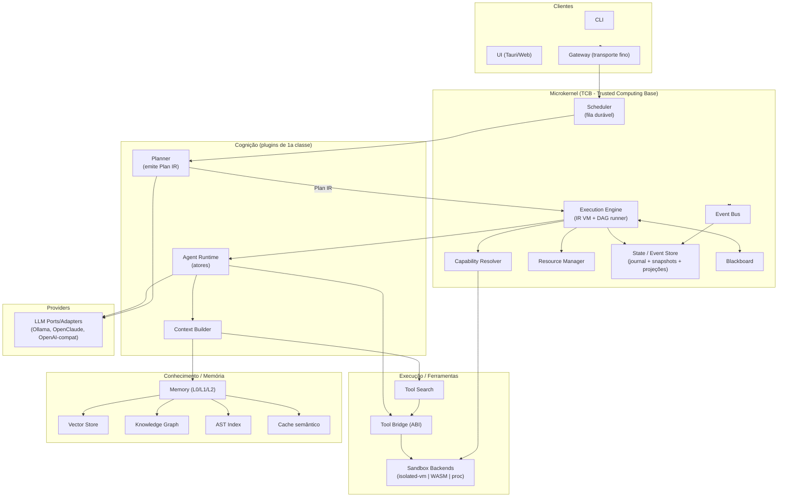

**Leitura:** o que está dentro de *Kernel* é a **TCB** (mínima e auditável). Tudo o
mais é plugin e roda fora da fronteira de confiança, mediado por capabilities e
sandbox.

---

## 5. Comparações obrigatórias e veredictos

### 5.1 Padrões de arquitetura

| Padrão | Papel no CloverOS | Veredicto |
|---|---|---|
| **Microkernel** | **Macro-arquitetura** (kernel mínimo + plugins) | ✅ **Escolhido** — isola a TCB; permite "milhares de tools/dezenas de modelos" sem tocar o core |
| **Plugin Architecture** | Mecanismo de extensão sobre o microkernel | ✅ **Escolhido** — corolário do microkernel |
| **Actor Model** | Modelo de execução/concorrência (workers) | ✅ **Escolhido** — isolamento + mailbox + sem estado compartilhado; escala para centenas de agentes |
| **Event-Driven** | Backbone de comunicação/observabilidade | ✅ **Escolhido** — desacopla, habilita replay/tracing |
| **Capability-Based Security** | Modelo de autorização | ✅ **Escolhido** — menor privilégio por task |
| **Blackboard** | Cognição compartilhada multi-agente | ✅ **Escolhido (com guarda)** — estruturado e event-sourced; evita o caos clássico de blackboard |
| **DAG / Workflow Engine** | Substrato de execução de planos | ✅ **Escolhido como substrato** — não como única forma de tarefa |
| **Pipeline** | Fast-path determinístico (reativo) | ✅ **Mantido como sub-padrão** — não como macro-arquitetura |
| **Hexagonal (Ports & Adapters)** | Idioma **local** p/ I/O externo (LLM, storage, sandbox) | ⚠️ **Parcial** — útil dentro de pacotes; **descartado como macro-arquitetura** |
| **Clean / Onion** | — | ❌ **Descartado como macro** — regram direção de dependência intra-serviço; não modelam concorrência, atores ou isolamento. Úteis só como disciplina interna de um pacote |
| **Layered** | — | ❌ **Descartado** — rígido; o fluxo de agentes é orientado a eventos e ciclos (plan→execute→replan), não a camadas estáticas |
| **ECS (Entity-Component-System)** | — | ❌ **Descartado** — projetado p/ simulação de alta frequência (jogos) com loops quentes sobre componentes. Agentes não são entidades com data-locality crítica; ECS aqui é complexidade sem retorno |
| **Workflow Engine "puro"** | — | ❌ **Descartado como único modelo** — tarefas reativas (1 tool) não devem pagar overhead de orquestração de workflow |

**Síntese:** Microkernel (macro) + Actor (execução) + Event-Driven (comunicação) +
Capability (segurança) + DAG/Blackboard (cognição) + Hexagonal (idioma local). Essa
combinação é coerente: cada padrão ocupa uma camada distinta, sem sobreposição.

### 5.2 Execução / Isolamento

| Opção | Vantagens | Riscos/Limitações | Veredicto |
|---|---|---|---|
| **Node `vm`** | Trivial | **Não é fronteira de segurança** (escapável); sem limite de RAM | ❌ Descartado p/ código não-confiável |
| **isolated-vm** | Isolate V8 real: cap de RAM, timeout de CPU, heap próprio | Só JS; custo de marshaling | ✅ **Tier 1** — glue/expressões JS autoradas pelo modelo |
| **Worker Threads** | Paralelismo real, mesmo processo | **Não é isolamento de segurança** (memória compartilhável, mesmo FS) | ✅ Usado **só p/ paralelismo confiável**, não como sandbox |
| **Child Process** | Isolamento de processo; portável | Coarse; precisa de SO p/ limitar CPU/RAM | ✅ **Tier 3** (endurecido com bubblewrap/landlock/seccomp/cgroups) |
| **Deno** | Permissões nativas, TS-first | Excluído pela decisão de runtime | ❌ Fora de escopo (documentado em ADR-003) |
| **QuickJS** (via WASM/lib) | JS minúsculo, determinístico, embutível | Lento; ES parcial | ⚪ Opcional p/ avaliar expressões puras determinísticas |
| **WASM (wasmtime/wasmer)** | **Poliglota**, sandbox forte, **fuel metering** (CPU), WASI capability-scoped | Ecossistema de libs limitado; FFI trabalhoso | ✅ **Tier 2** — tools/plugins poliglotas e compute não-confiável |
| **Runtime próprio** | Controle total | **NIH**; custo enorme; sem ganho real | ❌ Descartado |
| **Executor baseado em IR** | Determinístico, validável, cacheável, otimizável | Precisa projetar a IR | ✅ **Tier 0** — o coração da confiabilidade |

**Modelo de execução em camadas (do mais seguro/restrito ao mais permissivo):**

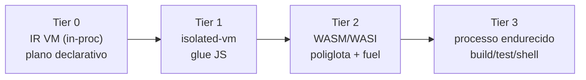

A maior parte do trabalho de um agente é **orquestração de tools** — resolvida no
Tier 0 sem executar código arbitrário. Só descemos de tier quando estritamente
necessário, sempre sob capability + Resource Manager.

### 5.3 Estado (escolher UM)

| Abordagem | Prós | Contras | Veredicto |
|---|---|---|---|
| **KV Store puro** | Simples, rápido | Sem histórico/auditoria; difícil replay | ❌ Insuficiente |
| **SQLite (só estado atual)** | Query rica, transações | Sem time-travel; é o que existe hoje via `sql.js` (export-on-write) | ⚪ **Parte** da solução (projeção), não o todo |
| **Event Sourcing** | Replay, auditoria, time-travel, recovery | Reconstrução custosa sem snapshots | ✅ **Núcleo** |
| **Append-only Log** | Durável, simples, append O(1) | Precisa de projeções p/ query | ✅ Implementação do event store |
| **Snapshotting** | Recovery/Resume rápido | Sozinho perde granularidade | ✅ **Complemento** (checkpoints) |
| **Hybrid State** | Combina o melhor | Mais peças | ✅ **Escolhido** (= ES + snapshots + projeções) |
| **CRDT** | Convergência multi-nó concorrente | Complexo; desnecessário sem multi-writer | ❌ **Adiado** (YAGNI; futuro distribuído) |

**Decisão única:** **Event Sourcing (append-only journal) + Snapshots periódicos +
projeções em SQLite nativo (`better-sqlite3`/libSQL).** O journal é a verdade; o
SQLite é um read-model materializado e descartável (reconstituível por replay).

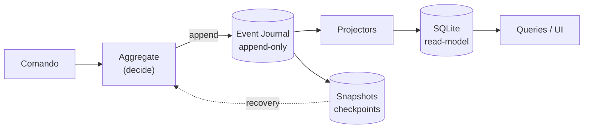

---

## 6. Intermediate Representation (IR) — a decisão central

### 6.1 Opção A vs Opção B

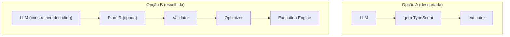

| Critério | A: LLM→TS | B: LLM→IR |
|---|---|---|
| **Previsibilidade** | Baixa — espaço de saída infinito; efeitos colaterais arbitrários | **Alta** — gramática fechada; nós declarativos |
| **Cacheabilidade** | Baixa — TS é textual e não-canônico | **Alta** — IR canonicalizável e content-addressable |
| **Otimização** | Difícil — exigiria analisar TS arbitrário | **Alta** — CSE, dead-node elimination, paralelização de nós independentes do DAG |
| **Testabilidade** | Difícil — testar geração de código | **Alta** — IR é dado: golden tests, property-based, fuzzing do validator |
| **Manutenção/Segurança** | Perigosa — `eval` de código autorado por modelo | **Alta** — nunca se executa código autorado pelo modelo; só IR validada |

**Veredicto:** **Opção B vence decisivamente.** Para modelos pequenos, geração direta
de TS é a pior escolha possível (junta a fragilidade de formatação com a superfície de
segurança de `eval`). **Opção A é descartada.**

### 6.2 A nuance que importa mais que a IR

O erro comum é transformar a IR em **outra** linguagem de programação que o modelo
precisa "formatar corretamente" — apenas trocando o inferno do JSON pelo inferno da
IR. As duas correções reais são:

1. **Constrained decoding (gramática GBNF / structured outputs):** o decoder do
   modelo é **restrito pela gramática da IR**, token a token. Um 8B literalmente **não
   consegue** emitir estrutura inválida. Isso ataca a causa-raiz de P1 (loops de erro de
   formatação) de forma muito mais eficaz do que qualquer prompt.
2. **IR declarativa, não Turing-completa:** a IR é um **DAG de invocações de tool +
   bindings de dados + controle limitado** (sem loops arbitrários, sem recursão livre).
   Expressividade suficiente para planos; pequena o bastante para validar e otimizar.

Isso também **reconcilia e supera** a hipótese do usuário de "Programmatic Tool
Calling = gerar scripts": o modelo **autora IR** (validada), e a IR **compila para** um
plano executável em sandbox. Ganha-se a expressividade de "programmatic" sem o risco de
código livre.

### 6.3 Esboço da IR (tipos)

```typescript
/** Um plano é um DAG acíclico de passos com bindings de dados. */
export interface PlanIR {
  version: '1';
  goalId: string;
  nodes: IRNode[];
  edges: IREdge[];        // dependências de dados/ordem (DAG)
  outputs: IRRef[];       // o que o plano "retorna"
}

export type IRNode =
  | ToolCallNode
  | MapNode            // fan-out determinístico sobre uma coleção
  | BranchNode         // escolha condicional (sem loop livre)
  | TransformNode      // expressão pura (avaliada no Tier 0/1)
  | SubPlanNode;       // delega a outro PlanIR (hierarquia)

export interface ToolCallNode {
  kind: 'tool_call';
  id: string;
  tool: string;                       // nome na Tool ABI
  args: Record<string, IRValue>;      // literais ou refs a saídas anteriores
  capabilities: CapabilityRequest[];  // caps mínimas exigidas
  retry?: RetryPolicy;
  cacheable?: boolean;
}

export interface IRRef { kind: 'ref'; nodeId: string; path?: string; } // ex.: $node3.files[0]
export type IRValue = string | number | boolean | null | IRRef | IRValue[] | { [k: string]: IRValue };

export interface IREdge { from: string; to: string; }
```

O **Validator** garante: aciclicidade, refs resolvíveis, tipos compatíveis com o
schema da tool, e que `capabilities` ⊆ capabilities da task. O **Optimizer** aplica
CSE (dedupe de chamadas idênticas), poda de nós sem efeito sobre `outputs`, e marca
nós independentes para execução paralela.

---

## 7. AST-first

O Clover deve operar **prioritariamente sobre AST** (via **tree-sitter**), não sobre
texto.

| Aspecto | Texto (hoje) | AST (proposto) |
|---|---|---|
| Edição | `search/replace` frágil (P5) | Transformações estruturais (rename, insert-in-scope, wrap) |
| Garantias | Nenhuma — pode gerar código inválido | Pode validar sintaxe antes de gravar |
| Retrieval | Chunking cego por tokens | Chunking por função/classe (unidades semânticas) |
| KG | Difícil extrair relações | Symbols/refs/imports extraídos diretamente da AST |

A AST alimenta o **AST Index** (§9) e o **Knowledge Graph** (§8/§9). Tools de edição
expõem operações estruturais; o fallback textual existe só para arquivos sem grammar.

---

## 8. Memória

### 8.1 Camadas

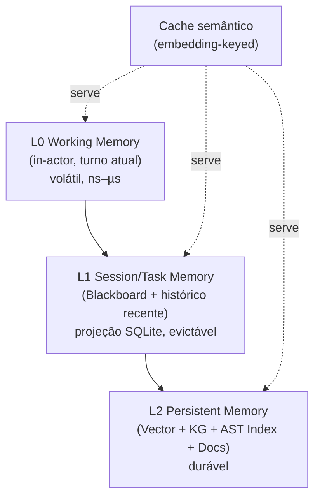

| Nível | Conteúdo | Quando é usado | Backing store |
|---|---|---|---|
| **L0 Working** | mensagens do turno, scratchpad, saídas de tool recentes | durante a execução de um ator | memória do processo |
| **L1 Sessão/Task** | blackboard da task, histórico comprimido, fatos derivados | entre turnos da mesma task | projeção SQLite (do event log) |
| **L2 Persistente** | embeddings, grafo, índice AST, docs | retrieval cross-task / cross-sessão | LanceDB + SQLite/kuzu + arquivos |
| **Cache semântico** | completions LLM, classificações, resultados de tool puros, **embeddings** | antes de qualquer chamada cara | KV + índice vetorial |

### 8.2 Cache semântico (corrige P8)

- **Embedding cache:** hoje o sistema re-embedda a cada query. Embeddings são
  determinísticos por (modelo, texto) → cache content-addressable.
- **Completion cache:** chamadas LLM com mesmo (prompt canônico, modelo, params) →
  reuso exato; opcionalmente reuso semântico (vizinho mais próximo acima de um
  threshold) para classificações.
- **Tool-result cache:** apenas tools **puras** (idempotentes, declaradas na ABI como
  `pure: true`).

### 8.3 Recuperação de contexto

O **Context Builder** (§11.4) decide o que entra no contexto sob um **orçamento de
tokens**, combinando L0 (sempre), L1 (blackboard relevante), L2 (top-k vetorial + KG
hops + trechos AST) e resultados de **Tool Search**.

---

## 9. Conhecimento

**Regra inviolável:** Obsidian/Markdown **nunca** é a fonte da verdade.

| Fonte | Papel | Veredicto |
|---|---|---|
| **AST Index** (tree-sitter) | Estrutura de código (symbols, refs, imports) | ✅ **Fonte primária** (derivada do repo) |
| **Knowledge Graph** | Relações (chama, importa, depende, documenta) | ✅ **Fonte primária derivada** |
| **Vector Store** | Similaridade semântica | ✅ **Fonte primária derivada** |
| **Documentação compilada** | Projeção legível (a partir de AST+KG) | ✅ Derivada — `graphify-out` já faz isso |
| **Obsidian / Markdown** | **Projeção** p/ humanos, editável, descartável | ⚠️ **Nunca SoT** |
| **Banco de grafos externo** (Neo4j etc.) | — | ❌ Peso operacional desnecessário; usar **embedded** (SQLite recursive CTEs ou **kuzu**) |

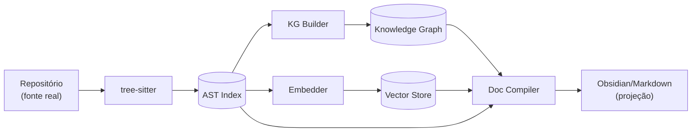

---

## 10. Segurança & Capability System

### 10.1 Modelo

Cada **task** recebe um **CapabilityToken** assinado, escopado e time-boxed. Tools
**declaram** as capabilities que exigem; o **Capability Resolver** cunha o token
**mínimo** que cobre o plano (§6). Workers **não podem ampliar** o token. As
capabilities mapeiam diretamente para o enforcement do sandbox (imports WASI, flags de
processo, allowlist de FS, política de rede).

```typescript
export type Capability =
  | { kind: 'fs.read'; pathGlob: string }
  | { kind: 'fs.write'; pathGlob: string }
  | { kind: 'proc.exec'; argv0Allow: string[]; maxProcs: number }
  | { kind: 'net'; hostAllow: string[] }
  | { kind: 'tool'; name: string }
  | { kind: 'llm'; model: string; maxTokens: number };

export interface CapabilityToken {
  id: string;
  taskId: string;
  caps: Capability[];
  issuedAt: number;
  expiresAt: number;        // time-boxed
  sig: string;              // assinado pelo Capability Resolver (HMAC/ed25519)
}

export interface CapabilityRequest { kind: Capability['kind']; scopeHint?: string; }
```

### 10.2 Defesa em profundidade (corrige P3/P4)

| Controle | Mecanismo |
|---|---|
| **Isolamento** | Sandbox em camadas (§5.2) — processo/WASM/isolate, nunca o processo do kernel |
| **FS** | Bind apenas dos paths concedidos; **resolução canônica** bloqueia escape por `..` **e por path absoluto** |
| **Rede** | Negada por padrão; allowlist por host via capability |
| **CPU/RAM** | cgroups v2 (proc) / fuel (WASM) / limites de isolate — via Resource Manager |
| **Timeout/Watchdog** | Deadline por nó do plano; watchdog mata e marca checkpoint |
| **Rollback** | Operações inversas (do event log) + snapshots de arquivo (`.clover/snapshots`) |
| **Auditoria** | Todo efeito é um evento no journal — trilha completa |

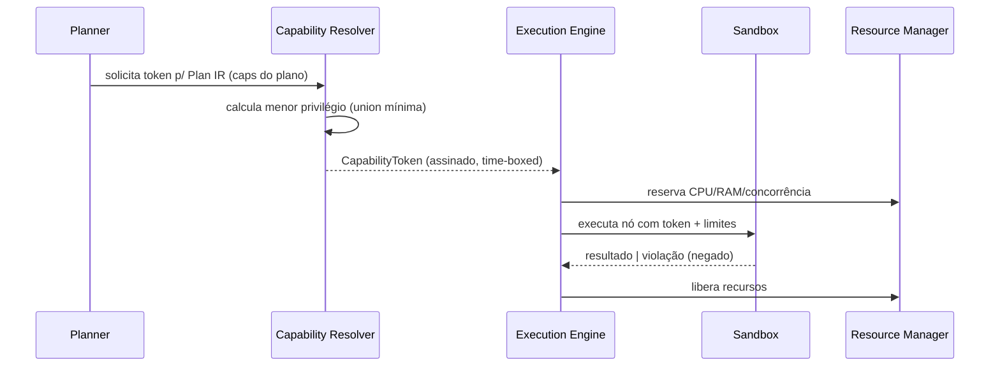

---

## 11. Componentes detalhados

> Responsabilidade, interface e classe principal de cada módulo.

### 11.1 Scheduler

**Responsabilidade:** transformar metas em tasks duráveis e despachá-las respeitando
prioridade, fairness e limites de concorrência do Resource Manager. Substitui o
fire-and-forget (P10): toda task é persistida e **resumível**.

```typescript
export interface Scheduler {
  submit(goal: Goal, opts?: SubmitOptions): Promise<TaskHandle>;
  cancel(taskId: string): Promise<void>;
  pause(taskId: string): Promise<void>;
  resume(taskId: string): Promise<void>;          // a partir do último checkpoint
  list(filter?: TaskFilter): Promise<TaskSummary[]>;
}

export interface SubmitOptions {
  priority?: number;            // 0 = normal
  deadline?: number;
  concurrencyClass?: string;    // p/ fairness entre workspaces
  budget?: ExecutionBudget;
}
```

### 11.2 Planner

**Responsabilidade:** decompor a meta em um **Plan IR** (§6) de forma **hierárquica**
(plano de alto nível → sub-planos), com **re-planejamento** quando um nó falha ou o
mundo muda. Emite IR sob constrained decoding.

```typescript
export interface Planner {
  plan(goal: Goal, ctx: PlanningContext): Promise<PlanIR>;
  replan(failed: ExecutionFault, prev: PlanIR, ctx: PlanningContext): Promise<PlanIR>;
}
```

**Crítica à hipótese "DAG planning":** correta como *substrato*, mas perigosa se
interpretada como "o modelo produz um DAG grande e correto de uma vez". Modelos 8B
não fazem isso de forma confiável. Por isso: **planos pequenos + re-planejamento**, e
**fast-path reativo** (sem DAG) para tarefas triviais.

### 11.3 Execution Engine (IR VM + DAG Runner)

**Responsabilidade:** validar, otimizar e executar o Plan IR; agendar nós
independentes em paralelo; aplicar capabilities, recursos e checkpoints **após cada
nó** (durabilidade para tarefas de horas/dias).

```typescript
export interface ExecutionEngine {
  run(plan: PlanIR, token: CapabilityToken, ctx: ExecContext): AsyncIterable<ExecEvent>;
  resume(taskId: string): AsyncIterable<ExecEvent>;   // de checkpoint
}

export type ExecEvent =
  | { type: 'node:start'; nodeId: string }
  | { type: 'node:done'; nodeId: string; output: unknown }
  | { type: 'node:fault'; nodeId: string; fault: ExecutionFault }
  | { type: 'checkpoint'; offset: number };
```

### 11.4 Context Builder

**Responsabilidade:** decidir **exatamente** o que entra no contexto do worker,
minimizando tokens. Determinístico e cacheável.

```typescript
export interface ContextBuilder {
  build(req: ContextRequest): Promise<BuiltContext>;
}
export interface ContextRequest {
  taskId: string;
  query: string;
  budget: TokenBudget;            // hard cap
  include?: ('history' | 'memory' | 'tools' | 'kg' | 'ast')[];
}
export interface BuiltContext {
  messages: Message[];
  tools: ToolDescriptor[];        // já filtradas por Tool Search
  tokensUsed: number;
  provenance: ProvenanceRef[];    // de onde veio cada pedaço (auditoria/replay)
}
```

### 11.5 Capability Resolver

Ver §10. Classe principal `CapabilityResolver` com `mint(plan, taskPolicy)` e
`verify(token)`.

### 11.6 Resource Manager

**Responsabilidade:** controlar CPU, RAM, GPU, timeout, concorrência e **orçamento de
contexto (tokens)**; aplicar backpressure ao Scheduler.

```typescript
export interface ResourceManager {
  reserve(req: ResourceRequest): Promise<ResourceLease>;
  release(lease: ResourceLease): void;
  limits(): ResourceLimits;
}
export interface ResourceRequest {
  cpuMillis?: number; memoryMB?: number; gpu?: boolean;
  timeoutMs: number; tokenBudget?: number;
}
export interface ResourceLimits { maxConcurrentActors: number; maxMemoryMB: number; gpuSlots: number; }
```

### 11.7 Blackboard

**Responsabilidade:** workspace compartilhado para colaboração multi-agente —
**estruturado, versionado e event-sourced** (não um dump mutável). Escritas são
eventos; leituras são consultas a uma projeção.

```typescript
export interface Blackboard {
  post(entry: BlackboardEntry): Promise<void>;   // append (evento)
  query(q: BlackboardQuery): Promise<BlackboardEntry[]>;
  subscribe(q: BlackboardQuery, cb: (e: BlackboardEntry) => void): Unsubscribe;
}
export interface BlackboardEntry {
  id: string; taskId: string; author: string;     // qual agente
  topic: string; payload: unknown; version: number; ts: number;
}
```

**Crítica:** blackboard sem disciplina vira estado global mutável (anti-padrão). A
guarda é: append-only + tópicos tipados + autoria registrada (auditável).

### 11.8 Cache

Ver §8.2. Interface unificada:

```typescript
export interface SemanticCache {
  getExact(key: CacheKey): Promise<CacheHit | null>;
  getNearest(key: CacheKey, threshold: number): Promise<CacheHit | null>;
  put(key: CacheKey, value: unknown, meta: CacheMeta): Promise<void>;
}
```

### 11.9 Memory

Ver §8. Fachada sobre os backends (vector/KG/AST/cache) com API de camadas.

```typescript
export interface Memory {
  remember(scope: MemoryScope, fact: MemoryFact): Promise<void>;
  recall(query: MemoryQuery): Promise<MemoryHit[]>;   // mistura vetor + KG + AST
  forget(scope: MemoryScope, filter?: MemoryFilter): Promise<void>;
}
export interface MemoryQuery { text: string; scope: MemoryScope; topK?: number; hops?: number; }
```

### 11.10 Event Bus

**Responsabilidade:** backbone de comunicação intra-kernel e ponto de captura para
observabilidade/replay. Promove o telemetry bus atual a cidadão de primeira classe.

```typescript
export interface EventBus {
  publish(evt: EventEnvelope): void;
  subscribe(pattern: TopicPattern, handler: EventHandler): Unsubscribe;
}
export interface EventEnvelope {
  id: string; topic: string; traceId: string; spanId?: string;
  ts: number; payload: unknown; source: string;
}
```

### 11.11 Knowledge Graph

Ver §9. Backing embarcado (kuzu ou SQLite + CTEs recursivas).

```typescript
export interface KnowledgeGraph {
  upsertNode(n: KGNode): Promise<void>;
  upsertEdge(e: KGEdge): Promise<void>;
  neighbors(id: string, rel?: string, hops?: number): Promise<KGNode[]>;
  query(cypherLike: string): Promise<KGResult>;
}
export interface KGNode { id: string; kind: string; props: Record<string, unknown>; }
export interface KGEdge { from: string; to: string; rel: string; props?: Record<string, unknown>; }
```

### 11.12 Tool Bridge / Tool ABI / Tool Search

**Tool ABI:** contrato único para **toda** tool — local, MCP, WASM, remota.

```typescript
export interface ToolDescriptor {
  name: string;
  description: string;
  inputSchema: JsonSchema;          // p/ constrained decoding e validação
  outputSchema?: JsonSchema;
  capabilities: CapabilityRequest[]; // o que exige
  pure?: boolean;                    // cacheável?
  origin: 'local' | 'mcp' | 'wasm' | 'remote';
}
export interface ToolBridge {
  list(): ToolDescriptor[];
  invoke(name: string, args: unknown, ctx: ToolInvocation): Promise<ToolResult>;
}
```

**Tool Search (Capability Discovery):** com milhares de tools, **não** se coloca todas
no contexto. Recupera-se semanticamente as relevantes (RAG sobre descrições) + um
conjunto curado "always-on". **É exatamente o que harnesses modernos fazem** (ex.: o
`ToolSearch` deste próprio ambiente). Endosso forte da hipótese do usuário.

```typescript
export interface ToolSearch {
  find(query: string, k: number): Promise<ToolDescriptor[]>;
}
```

### 11.13 Sandbox

**Responsabilidade:** backend plugável de isolamento (§5.2), selecionado por tier e
governado por capabilities + Resource Manager.

```typescript
export interface SandboxBackend {
  kind: 'isolated-vm' | 'wasm' | 'process';
  run(unit: ExecutableUnit, token: CapabilityToken, limits: ResourceLimits): Promise<SandboxResult>;
}
```

### 11.14 Plugin SDK

**Responsabilidade:** permitir adicionar **agents, tools, models, linguagens, backends
de memória/sandbox** sem tocar o Core (microkernel). Manifesto declarativo + ABI
versionada.

```typescript
export interface PluginManifest {
  name: string; version: string;
  kind: 'tool' | 'agent' | 'model-provider' | 'language-runtime' | 'memory-backend' | 'sandbox-backend';
  abiVersion: string;            // compatibilidade com o kernel
  capabilities: CapabilityRequest[];
  entry: string;
}
export interface CloverPlugin<TManifest = PluginManifest> {
  manifest: TManifest;
  activate(host: KernelHost): Promise<void>;
  deactivate?(): Promise<void>;
}
```

---

## 12. Ciclo de vida de uma Task

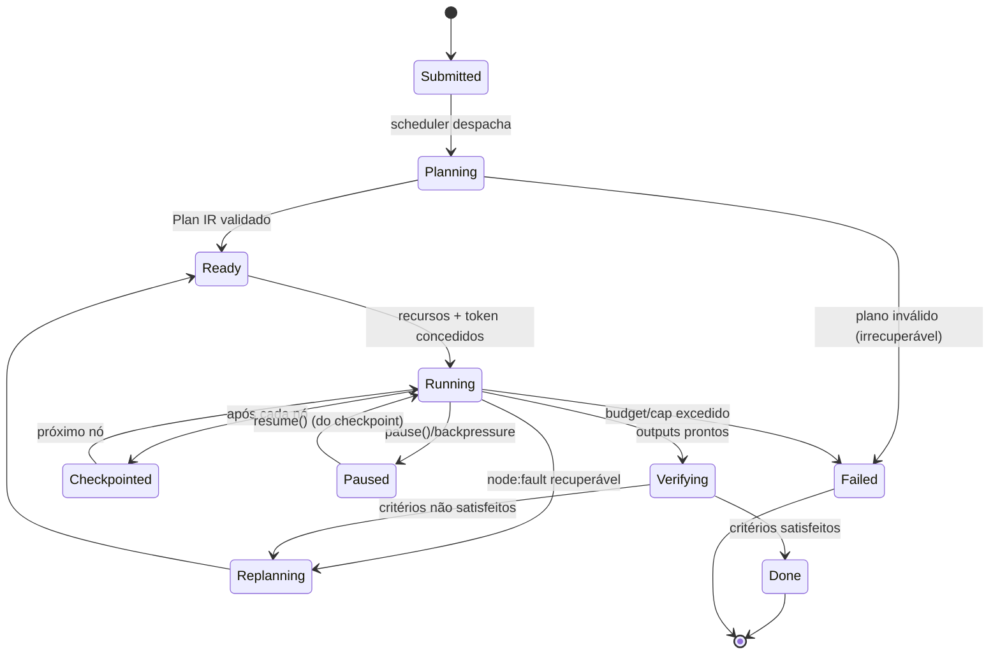

**Durabilidade:** como cada transição é um evento e há checkpoint após cada nó, um
crash do processo permite **resume** exato — viabilizando tarefas de horas/dias (P10
resolvido).

---

## 13. Fluxo completo (sequência end-to-end)

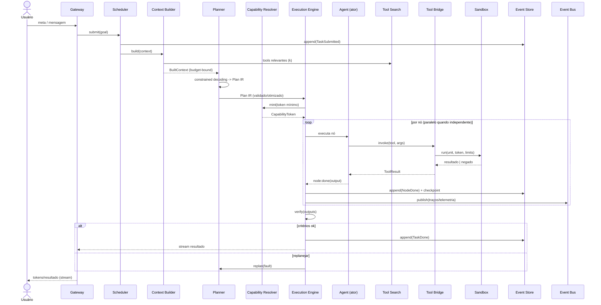

---

## 14. Estrutura do monorepo

```
cloveros/
├─ apps/
│  ├─ cli/                      # CLI
│  ├─ ui/                       # UI (Tauri/Web)
│  └─ gateway/                  # transporte fino (HTTP/WS) -> Scheduler
├─ kernel/                      # TCB — núcleo mínimo e auditável
│  ├─ kernel/                   # @clover/kernel (lifecycle, plugin host, ABI)
│  ├─ event-bus/                # @clover/event-bus
│  ├─ scheduler/                # @clover/scheduler (fila durável)
│  ├─ capability/               # @clover/capability (tokens, resolver)
│  ├─ resource-manager/         # @clover/resource-manager
│  ├─ blackboard/               # @clover/blackboard
│  └─ state/                    # @clover/state (event store + snapshots + projeções)
├─ cognition/
│  ├─ planner/                  # @clover/planner (emite Plan IR)
│  ├─ ir/                       # @clover/ir (schema + validator + optimizer)
│  ├─ executor/                 # @clover/executor (IR VM + DAG runner durável)
│  ├─ context-builder/          # @clover/context-builder
│  └─ agent-runtime/            # @clover/agent-runtime (host de atores)
├─ knowledge/
│  ├─ memory/                   # @clover/memory (camadas + cache semântico)
│  ├─ vector/                   # @clover/vector (LanceDB)
│  ├─ knowledge-graph/          # @clover/knowledge-graph (kuzu/SQLite)
│  └─ ast-index/                # @clover/ast-index (tree-sitter)
├─ execution/
│  ├─ tool-abi/                 # @clover/tool-abi (contratos)
│  ├─ tool-bridge/              # @clover/tool-bridge (local + MCP + remoto)
│  ├─ tool-search/              # @clover/tool-search
│  └─ sandbox/                  # @clover/sandbox (isolated-vm | wasm | process)
├─ providers/
│  └─ llm/                      # @clover/llm (ports + adapters)
├─ sdk/
│  └─ plugin-sdk/               # @clover/plugin-sdk
└─ shared/
   ├─ contracts/                # @clover/contracts (tipos compartilhados)
   └─ observability/            # @clover/observability (log/trace/metrics/replay)
```

**Regra de dependência:** `kernel/*` não importa de `cognition/`, `knowledge/`,
`execution/` ou `providers/` — apenas de `shared/contracts`. Plugins dependem do
`sdk/`. Isso mantém a TCB pequena e a direção de dependência saudável (idioma
hexagonal *dentro* dos pacotes, não como macro).

---

## 15. Rollback, Checkpoints e Recovery

| Mecanismo | Como |
|---|---|
| **Checkpoints** | Após cada nó do DAG, grava-se `offset` do journal + estado do plano. Resume parte do último checkpoint. |
| **Rollback** | Efeitos com inverso conhecido (escrita de arquivo ↔ snapshot; criação ↔ remoção) são desfeitos lendo o event log na ordem inversa. |
| **Recovery (crash)** | Na inicialização, o kernel relê o journal a partir do último snapshot, reconstrói projeções e **retoma** tasks em `Running`/`Paused`. |
| **Compensações** | Para efeitos irreversíveis (ex.: `git push`), o nó declara uma **ação compensatória** opcional na IR; sem ela, requer capability extra e confirmação. |

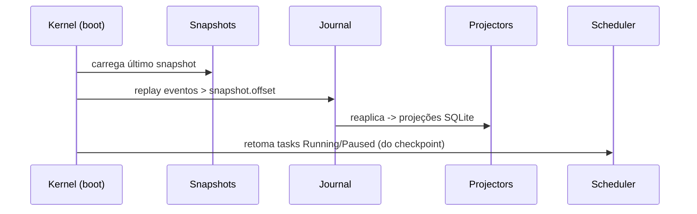

---

## 16. Testabilidade

A arquitetura é desenhada para ser testável **porque** o plano é dado (IR) e o estado
é um log.

- **Unit:** validator/optimizer da IR (entrada IR → IR canônica) com **property-based
  testing** e **fuzzing** (garantir que IR inválida nunca é aceita).
- **Golden tests:** meta → Plan IR esperado (com modelo mockado/determinístico).
- **Simulação determinística:** o Execution Engine roda contra **tools fake** e um
  **clock virtual**; como tudo é evento, a execução é reproduzível.
- **Replay-based:** qualquer incidente de produção vira um teste (re-executa o journal).
- **Contract tests:** todo plugin é validado contra a Tool ABI / Plugin ABI.
- **Sandbox tests:** asserts de que capabilities negadas realmente bloqueiam (FS/rede/
  proc), incluindo tentativas de escape por path absoluto e `..`.

### Pirâmide

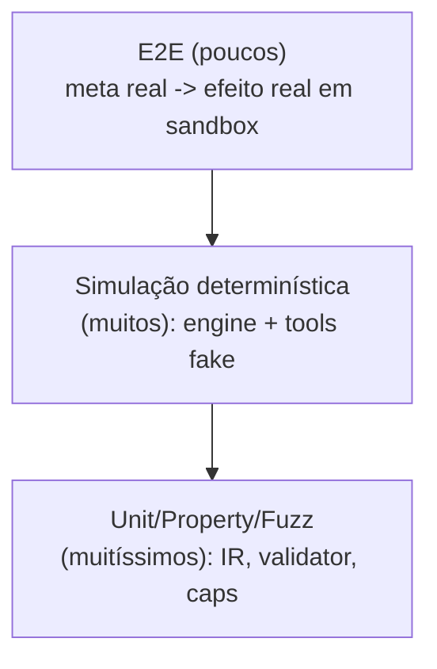

---

## 17. Benchmark

Métricas que importam para um "OS de agentes" com modelos pequenos (não é latência
bruta — o usuário declarou que desempenho não é prioridade):

| Categoria | Métrica | Por quê |
|---|---|---|
| **Confiabilidade** | Task success rate; **malformed-IR rate** (deve →0 com constrained decoding) | Mede o fix de P1 |
| **Eficiência cognitiva** | Tokens por task; cache hit-rate (semântico/embedding) | Mede custo real em modelo local |
| **Robustez** | Recovery success após crash; resume-correctness | Valida durabilidade (P10) |
| **Planejamento** | Replan-rate; profundidade média de plano; % nós paralelizados | Qualidade do planner |
| **Segurança** | Nº de violações de capability bloqueadas; escape attempts barrados | Valida P3/P4 |
| **Escala** | Tasks concorrentes sustentadas; throughput do journal | Valida visão de milhares de tasks |

Infra de benchmark: um **harness de cenários** (suite de metas com critérios de
aceitação verificáveis) rodando contra modelos locais fixados, comparando versões via
replay — resultados versionados junto ao repo.

---

## 18. Observabilidade

Tudo deriva do **Event Bus** + **Event Store**.

| Capacidade | Fonte |
|---|---|
| **Logs estruturados** | eventos → JSONL (já existe) com `traceId`/`spanId` |
| **Tracing distribuído** | spans por ator/nó, correlacionados por `traceId` (entre atores e subagents) |
| **Profiling** | duração por nó/tool/sandbox; flamegraph de plano |
| **Auditoria** | o journal **é** a trilha de auditoria (imutável) |
| **Métricas** | agregações sobre projeções (success rate, tokens, cache) |
| **Replay** | reexecução do journal (debug e testes) |
| **Timeline de decisões** | sequência completa: contexto montado → IR → caps → nós → resultados |

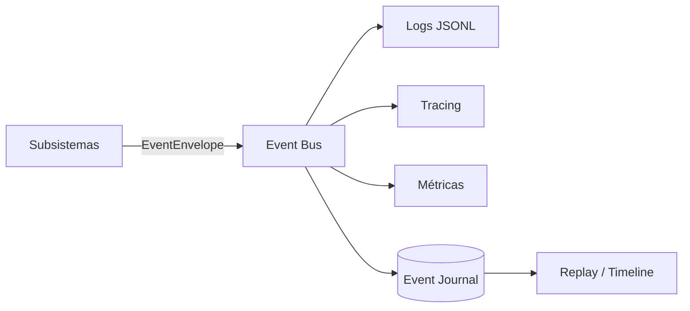

---

## 19. Escalabilidade

- **Atores** desacoplam concorrência: centenas de agentes = centenas de atores
  agendados sob limites do Resource Manager (não threads OS 1:1).
- **Tool Search** mantém o contexto pequeno mesmo com **milhares de tools**.
- **Plugins** permitem **dezenas de modelos / múltiplos runtimes / múltiplas
  linguagens** sem tocar o kernel.
- **Event store** com projeções escala leitura/escrita independentemente (append O(1)
  + read-models especializados).
- **Execução distribuída (futuro):** como atores se comunicam por eventos e o estado é
  um log, mover atores para outros nós é uma evolução natural (transport do Event Bus
  + journal replicado). **É aqui — e só aqui — que CRDT eventualmente entra**, se
  houver edição concorrente multi-nó.

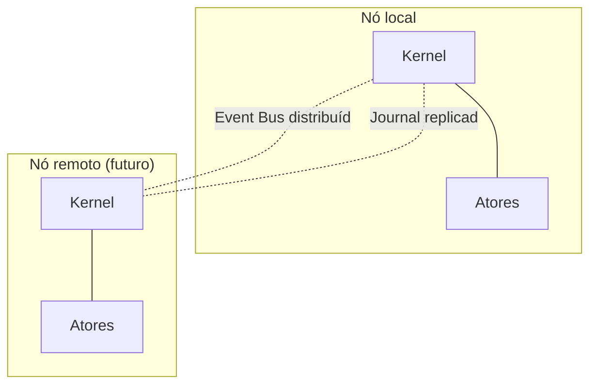

---

## 20. Trade-offs (consolidado)

| Decisão | Ganhamos | Pagamos | Mitigação |
|---|---|---|---|
| IR + constrained decoding | Confiabilidade, cache, otimização | Esforço de projetar/manter a gramática e o validator | IR pequena e versionada; fuzzing |
| Microkernel + plugins | Evolutividade, TCB pequena | Indireção; ABI a manter | ABI versionada; contract tests |
| Actor model | Isolamento, escala | Complexidade de coordenação | Blackboard estruturado + event bus |
| Event sourcing | Replay, recovery, auditoria | Mais armazenamento; projeções a manter | Snapshots; projeções descartáveis |
| Sandbox em camadas | Segurança real | Custo de marshaling; setup por SO | Maioria do trabalho fica no Tier 0 |
| AST-first | Edições seguras | tree-sitter por linguagem | Fallback textual p/ linguagens sem grammar |
| Plan-and-execute hierárquico | Robustez com modelos pequenos | Re-planejamento custa chamadas LLM | Cache semântico; fast-path reativo |

---

## 21. Decisões descartadas (consolidado)

| Descartado | Motivo técnico |
|---|---|
| **LLM → TypeScript → executor (Opção A)** | Pior previsibilidade/cacheabilidade/testabilidade + risco de `eval` de código autorado por modelo |
| **Node `vm` como sandbox** | Não é fronteira de segurança (escapável) |
| **Runtime próprio** | NIH; custo desproporcional; nenhum ganho sobre Node + WASM/isolated-vm |
| **Deno / core em Rust-Go** | Excluídos pela decisão de runtime (mantidos como alternativas em ADR-003) |
| **ECS como macro-arquitetura** | Domínio errado (simulação de alta frequência); complexidade sem retorno |
| **Clean/Onion/Layered como macro** | Não modelam concorrência/atores/isolamento; servem só como disciplina intra-pacote |
| **Graph DB externo (Neo4j etc.)** | Peso operacional; embedded (kuzu/SQLite) basta |
| **Obsidian como fonte da verdade** | App mutável por humanos; deve ser projeção derivada |
| **`sql.js` (export-on-write)** | Não escala; substituído por SQLite nativo como projeção |
| **CRDT agora** | Sem multi-writer concorrente, é complexidade prematura |
| **Worker Threads como sandbox** | Concorrência ≠ isolamento de segurança |
| **2 chamadas LLM (classify+extract) por ação** | Substituídas por um único passo de constrained decoding → IR |

---

## 22. Roadmap técnico (evolução nos próximos anos)

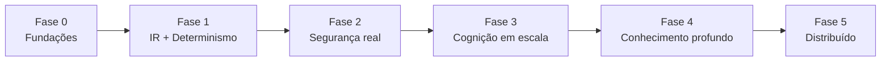

- **Fase 0 — Fundações (TCB):** Event Bus de 1a classe; Event Store (journal +
  snapshots + projeções SQLite nativas, **substituindo `sql.js`**); Scheduler durável;
  contratos em `shared/contracts`. *Resolve P2, P7, P10.*
- **Fase 1 — IR + Determinismo:** Plan IR + Validator + Optimizer; **constrained
  decoding** no provider de LLM; Execution Engine (IR VM + DAG runner) com checkpoints;
  unificar os caminhos de LLM. *Resolve P1, P6, P11, P12.* **(maior ROI)**
- **Fase 2 — Segurança real:** Capability System + sandbox em camadas (isolated-vm →
  WASM → processo endurecido); Resource Manager (CPU/RAM/timeout). *Resolve P3, P4.*
- **Fase 3 — Cognição em escala:** Actor runtime + planner hierárquico/re-plan; Tool
  ABI + Tool Search; Blackboard estruturado; cache semântico. *Resolve P8; habilita
  centenas de agentes/milhares de tools.*
- **Fase 4 — Conhecimento profundo:** AST Index (tree-sitter) + edições estruturais;
  Knowledge Graph embarcado; docs compiladas como projeção (Obsidian read-only).
  *Resolve P5, P9.*
- **Fase 5 — Distribuído (opcional):** Event Bus/journal distribuídos; atores remotos;
  CRDT **somente** se surgir edição concorrente multi-nó.

---

## 23. Veredicto sobre as hipóteses do usuário (consolidado)

| Hipótese | Veredicto | Observação |
|---|---|---|
| Planejamento baseado em DAG | ✅ como **substrato** | Não como DAG único upfront; hierárquico + re-plan |
| Workers pequenos | ✅✅ | Mitigação central da degradação de contexto |
| Capability Discovery (Tool Search) | ✅✅ | Essencial em escala; RAG sobre tools |
| Programmatic Tool Calling (gerar scripts) | ⚠️ **substituído** | Por **IR constrangida** + constrained decoding |
| Tool Bridge | ✅ | Generalizar para **Tool ABI** uniforme |
| Blackboard | ✅ com guarda | Estruturado + event-sourced |
| Cache semântico | ✅✅ | Ausente hoje; grande ganho |
| Knowledge Graph | ✅ | Derivar do AST; embedded; sem super-investir cedo |
| Event Bus | ✅✅ | Promover a 1a classe |
| Sandboxes | ✅✅ | Maior lacuna atual |
| Atualização automática de documentação | ✅ | Como projeção derivada |
| Planejamento + Execução | ✅ | Plan-and-execute |

**Nenhuma hipótese mantida apenas por ter sido sugerida.** A única descartada de fato
("gerar scripts") foi substituída por algo estritamente superior para o objetivo
declarado (confiabilidade com modelos pequenos).

---

## 24. Apêndice — Mapa dos 36 pontos pedidos → seções

1 Revisão crítica §1 · 2 Problemas §2 · 3 Arquitetura final §4 · 4 Trade-offs §20 ·
5 Decisões descartadas §21 · 6 Justificativas §3,§5,§6 · 7 Diagramas Mermaid (todo o
doc) · 8 Sequência §10.2,§13 · 9 Componentes §4,§11 · 10 Fluxo completo §13 ·
11 Monorepo §14 · 12 Interfaces TS §6,§10,§11 · 13 Classes principais §11 ·
14 Responsabilidades §11 · 15 Ciclo de vida da Task §12 · 16 Scheduler §11.1 ·
17 Planner §11.2 · 18 Executor §11.3 · 19 Context Builder §11.4 · 20 Capability
Resolver §10,§11.5 · 21 Resource Manager §11.6 · 22 Blackboard §11.7 · 23 Cache §8.2,
§11.8 · 24 Memory §8,§11.9 · 25 Event Bus §11.10 · 26 Knowledge Graph §9,§11.11 ·
27 Tool Bridge §11.12 · 28 Sandbox §5.2,§11.13 · 29 Plugin SDK §11.14 · 30 Rollback
§15 · 31 Checkpoints §15 · 32 Recovery §15 · 33 Testabilidade §16 · 34 Benchmark §17 ·
35 Observabilidade §18 · 36 Roadmap §22.

---

## Referências internas

- ADR-002 — Pipeline de Execução Robusto e Determinístico (`docs/adr/002-robust-pipeline.md`)
- ADR-003 — Runtime e Modelo de Execução (`docs/adr/003-runtime-e-modelo-de-execucao.md`)
- ADR-004 — IR vs. Geração de Código (`docs/adr/004-ir-vs-codegen.md`)
- ADR-005 — Modelo de Estado (`docs/adr/005-modelo-de-estado.md`)
