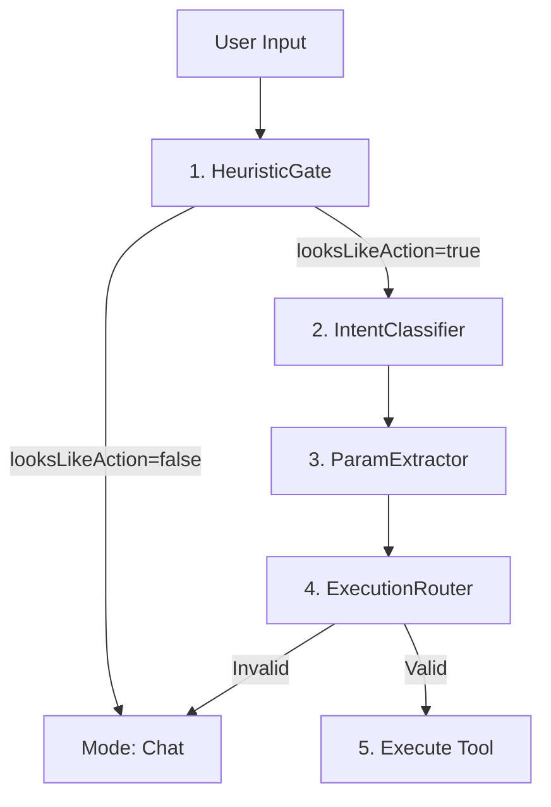

# Arquitetura do Pipeline Clover

O Clover utiliza um pipeline de 5 estágios para garantir execução determinística e resiliente de ferramentas, minimizando alucinações de modelos de linguagem (LLMs).

## Fluxo do Pipeline

## 1. HeuristicGate
Filtro leve (zero-LLM) para detectar intenções de sistema de arquivos.
- **Objetivo:** Recall alto (preferir falsos positivos a falsos negativos).
- **Threshold:** Score >= 2 para avançar.
- **Features:** Caminhos de arquivos, verbos de ação, substantivos de FS, deíticos.

## 2. IntentClassifier
Classificador baseado em LLM (Ollama) com cache e atalhos de contexto.
- **Context Shortcut:** Reutiliza o `lastIntent` apenas se a entrada for puramente deítica (ex: "nele", "la") e não houver novos verbos conflitantes.
- **Prompting:** Instruído a priorizar verbos sobre referências de contexto.

## 3. ParamExtractor
Extração estruturada de parâmetros com prioridade rigorosa.
- **Ordem de Resolução de Path:**
    1. Path Explícito (absoluto ou com extensão)
    2. Nome Natural ("arquivo teste txt")
    3. Localização Conhecida ("desktop", "downloads")
    4. Contexto Deítico (`lastFilePath` se "nele", "la" presente)
    5. Fallback do Workspace

## 4. ExecutionRouter
A camada de força bruta que mapeia intenções para ferramentas reais.
- **Tool Forcing:** Se a intenção é `write_file`, a ferramenta `write-file` é chamada sem decisão do LLM.
- **Validação Segura:** Impede escrita em diretórios, leitura de arquivos inexistentes e execuções com confiança < 0.5.

## 5. OS Abstraction
- Normalização de caminhos via `node:path`.
- Mapeamento de comandos frágeis (ex: `whoami` -> `os.userInfo()`).
- Resolução de `~` e variáveis de ambiente comuns.

---
Documentação gerada via skill `doc-project`.
