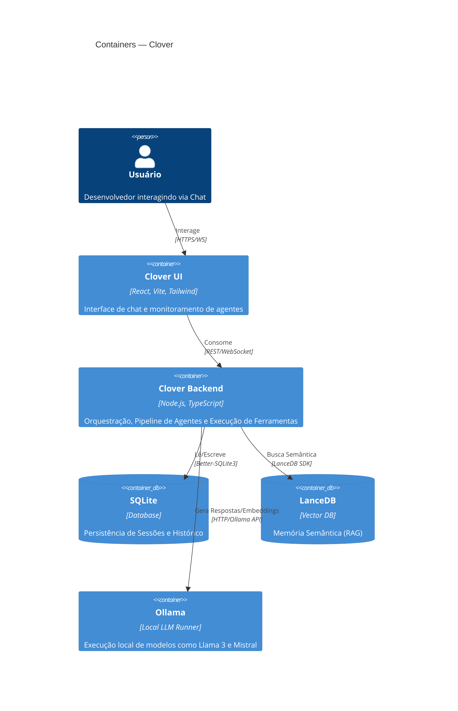

# Clover - Assistente IA Local e Autônomo

Clover é um assistente de inteligência artificial focado em execução local, privacidade e autonomia. Ele utiliza uma arquitetura multi-agente e um pipeline determinístico para garantir que as ferramentas sejam executadas de forma segura e contextual.



## URLs do Projeto
| Ambiente | URL |
|---|---|
| Desenvolvimento (UI) | http://localhost:5173 |
| Backend API | http://localhost:3000 |

## Início Rápido

### Pré-requisitos
- Node.js 18+
- Ollama instalado e rodando
- PowerShell (para scripts de automação)

### Instalação
```bash
# Instalar dependências
npm install

# Rodar o backend
npm run dev:backend

# Rodar a UI
npm run dev:ui
```

## Documentação Técnica
- [Arquitetura](./docs/architecture.md)
- [Fluxos do Sistema](./docs/flows.md)
- [Convenções de Código](./docs/conventions.md)
- [Guia de Contribuição](./docs/contributing.md)

## Troubleshooting
- **Erro de Conexão com Ollama:** Verifique se o Ollama está rodando (`ollama serve`) e se o modelo configurado foi baixado (`ollama pull llama3`).
- **Workspace Boundary Error:** O Clover impede a edição de arquivos fora do diretório configurado em `CLOVER_WORKSPACE`. Verifique as permissões de caminho.
