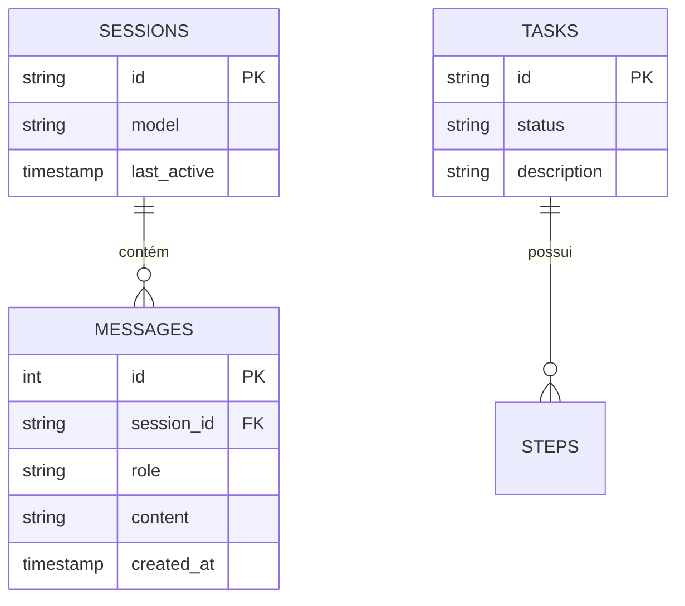

# Arquitetura do Sistema

O Clover foi projetado para ser modular, extensível e seguro. A separação entre o orquestrador de agentes e o pipeline de execução permite que diferentes modelos de IA sejam plugados sem alterar a lógica de negócio.

## Visão Geral de Módulos

| Módulo | Responsabilidade |
|---|---|
| **Orchestrator** | Ponto de entrada único. Gerencia sessões, recupera memórias via RAG e despacha para o Agent Engine. |
| **Agent Engine** | Seleciona o agente apropriado (Coder, General, Researcher) e gerencia o loop de pensamento/ferramenta. |
| **Execution Pipeline** | Garante determinismo. Passa por 4 estágios antes de tocar no sistema operacional. |
| **Memory Service** | Interface com LanceDB para indexação de arquivos e busca de contexto relevante. |
| **Exec Guard** | Camada de segurança que valida comandos shell e limites de diretório (Workspace Boundary). |

## Modelo de Dados (ERD)

## Decisões Arquiteturais (ADRs)
- [ADR 001: Uso de SQLite para Persistência Local](./adr/001-sqlite-persistence.md)
- [ADR 002: Pipeline Determinístico vs Tool Calling Nativo](./adr/002-deterministic-pipeline.md)
