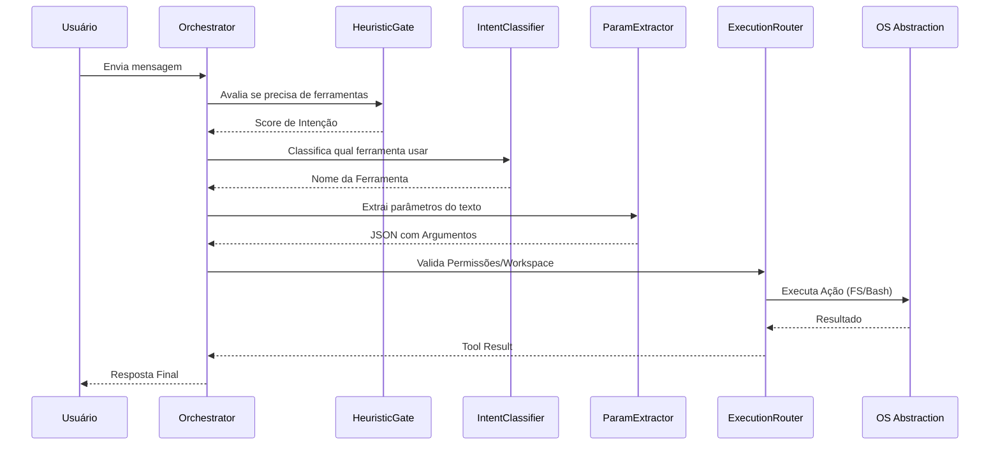
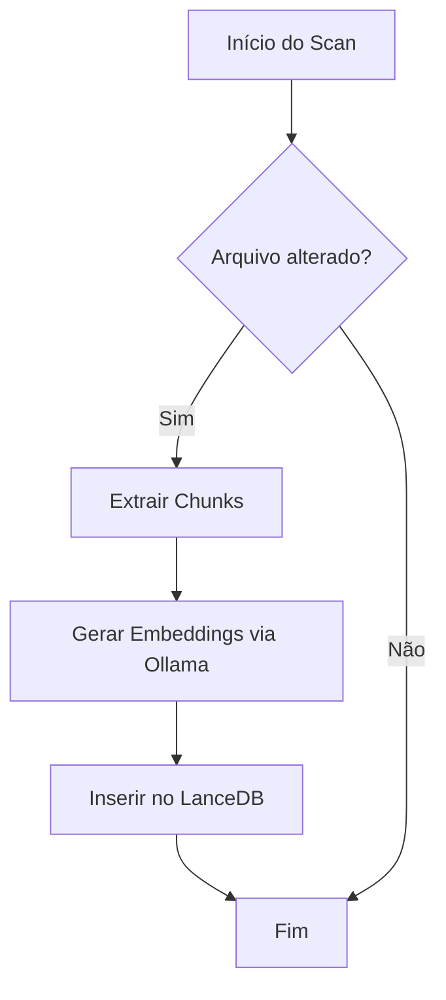
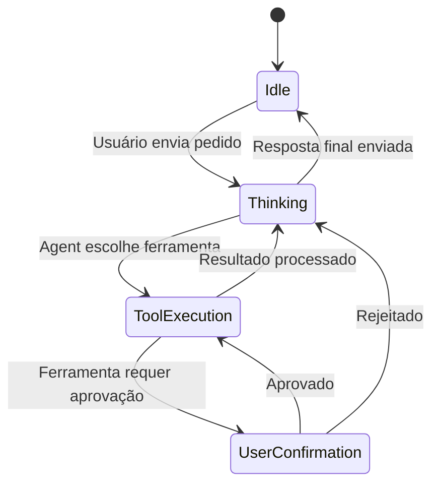

# Fluxos do Sistema

## 1. Pipeline de Processamento de Mensagem

Este é o fluxo principal quando o usuário envia uma mensagem. O objetivo é transformar uma intenção em linguagem natural em uma ação segura no sistema operacional.

## 2. Indexação de Memória (RAG)

Fluxo de como o Clover "aprende" sobre o código do usuário.

## 3. Ciclo de Vida de uma Task Autônoma

